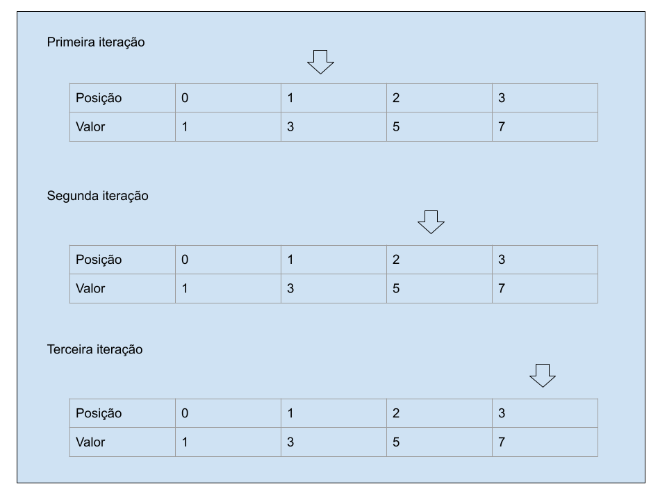

# Busca binária - Binary Search

A busca binária é um jeito eficiente de encontrar um número em uma lista organizada. Começa no meio da lista e compara com o valor desejado. Se for igual, terminou. Se for menor, busca na metade direita; se for maior, busca na metade esquerda. Repete até encontrar ou reduzir a lista. É útil para encontrar coisas em listas grandes e ordenadas, como catálogos online.

# Exemplo - Teste de Mesa

Vamos supor a seguinte lista `[1, 3, 5, 7]` e queremos encontrar o valor `5` dentro dessa lista, iremos usar a função implementada `recursiveAlgorithm` como exemplo. **Ignore as peculariedades da lingugaem de programação Kotlin.**

```kotlin
tailrec fun <T : Comparable<T>> recursiveAlgorithm(
    findValue: T,
    list: List<T> = emptyList(),
    left: Int = 0,
    right: Int = list.size - 1
): T? {
    return if (right >= left) {
        val mid = (right + left) / 2
        val currentValue = list[mid]

        when {
            currentValue == findValue -> currentValue
            currentValue > findValue -> recursiveAlgorithm(findValue, list, left, mid - 1)
            else -> recursiveAlgorithm(findValue, list, mid + 1, right)
        }
    } else null
}
```

Iniciando a chamada da função.

```kotlin
val findValue = 7

val actual = binarySearch.recursiveAlgorithm(findValue, listOf(1, 3, 5, 7).toList())

assertEquals(findValue, actual)
```

## Iterações, os valores `findValue = 7` e `list = listOf(1, 3, 5, 7)` sempre serão os mesmos:

* **Na primeira iteração** teremos os seguintes valores para `left = 0` e `right = 3`, então teremos a primeira validação para sabermos se já percorremos toda a lista e não encontramos o valor `if (right >= left)`, nesse caso a condição será `false` e então podemos seguir. Começamos procurando no meio da lista como nossa lista tem 4 item porém a última posíção é a 3 (pois a lista começa na posição zero) o nosso meio será a posição 1 que representa o valor 3 na lista. Como esse valor não é o que buscamos, então precisamos checar, o valor atual (3) é maior que eu estou buscando (7)? Não! O 3 é menor que o 7, então essa condição será executada `recursiveAlgorithm(findValue, list, mid + 1, right)`, ok, mas o que isso representa? Como o nosso meio `mid` é a posição 1, valor 3, e esse valor é menor que estamos consultando que é o 7, então aumentamos o meio para mais 1 no lado esquerdo pois podemos ignorar o valor 1 na posição 0 e o valor 3.

* **Na segunda iteração** a variável `left = 2` (pois antes era 1 e somamos com mais 1) e o `right = 3` continua igual pois não podemos ignorar o que tem na direita. Repetindo o mesmo processo, o valor `right` continua sendo maior que `left`, significando que ainda temos itens para checar pois não percorremos toda a lista. e agora, ao pegarmos o novo meio teremos o seguinte `val mid = (3 + 2) / 2`, o `mid` terá o valor 2 (posição) que representa o valor 5 na lista. E então repetimos o processo, o valor atual é maior que o valor para buscar? `5 > 7`? Não! Então repetimos o processo do primeiro passo, `recursiveAlgorithm(findValue, list, mid + 1, right)` somando o valor `mid +1` para `mid` com o valor 3.

* **Terceira e última iteração** a variável `left = 3` e `right = 3`, agora somando essas posições por 2, teremos (3 + 3) / 2 resultando em 3! Ou seja, agora encontramos a posição que gostaríamos!!! Pois na hora de comparar, o valor que estamos buscando é o mesmo que estamos acessando nessa iteração e então o valor é retornado.

# Conclusões
Apesar do exemplos ser extremamente simples, podemos ver que se utilizarmos um `foreach` comum, até encontramos o valor 7 levaríamos 4 iterações, pois precisaríamos passar por todos os valores, porém utilizando a busca binária, na **primeira iteração** conseguimos ver que o valor 3 encontrado era menor do que estávamos procurando, ou seja, tudo o que estava na esquerda, no caso o valor 1, poderia já ser ignorado pois saberíamos que o valor que queríamos estaria na direita reduzindo a quantidade de iterações de 4 para 3! O exemplo, utilizou muito o lado esquerdo para ignorar porém é a mesma ideia caso o valor atual seja maior que o que estamos procurando, então devemos ignorar o lado direito e ir reduzindo a posição. Abaixo há um exemplo com diagrama para ficar mais fácil como foi aplicado o algoritmo na lista. Espero que isso tenha ajuda de alguma forma :smile:. 

# Diagrama
