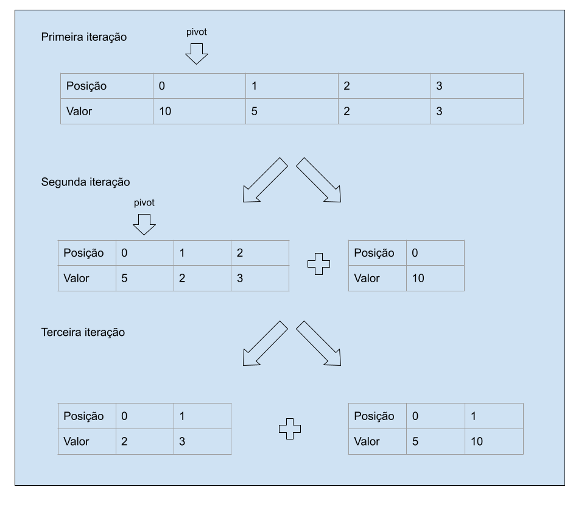

# Ordenação Rápida - Quick Sort

O algoritmo Quick Sort é um eficiente algoritmo de ordenação que segue a abordagem "dividir para conquistar". Ele funciona da seguinte forma:

Escolhe um elemento da lista, chamado de "pivô".
Reorganiza os elementos da lista de modo que todos os elementos menores que o pivô fiquem à esquerda, e todos os elementos maiores fiquem à direita.
Repete o processo para as sublistas à esquerda e à direita do pivô, aplicando recursão.
Continua esse processo até que todas as sublistas estejam ordenadas.
O Quick Sort é eficiente em média e na prática, com uma complexidade de tempo média de O(n * log(n)), mas pode ter um desempenho ruim no pior caso (O(n^2)) se o pivô for mal escolhido. Para evitar isso, é comum usar estratégias para escolher um pivô adequado, como o pivô mediano de três.

# Exemplo - Teste de Mesa

Vamos supor a seguinte lista `[10, 5, 2, 3]` e queremos ordenar a lista usando como pivô sempre a primeira posição da lista.

```kotlin
fun algorithm(arr: Array<Int>): Array<Int> {
    return if (arr.size < 2) {
        arr
    } else {
        val pivot = arr[0]
        val (less, bigger) = arr.drop(1)
                .toTypedArray()
                .partition { it < pivot }
        algorithm(less.toTypedArray()) + arrayOf(pivot) + algorithm(bigger.toTypedArray())
    }
}
```

Iniciando a chamada da função.

```kotlin
val arr = arrayOf(10, 5, 2, 3)
val expectedArr = arrayOf(2, 3, 5, 10)

assertContentEquals(expectedArr, quickSort.algorithm(arr))
```

## Iterações: 

* **Na primeira iteração** 

# Conclusões
:smile:. 

# Diagrama
